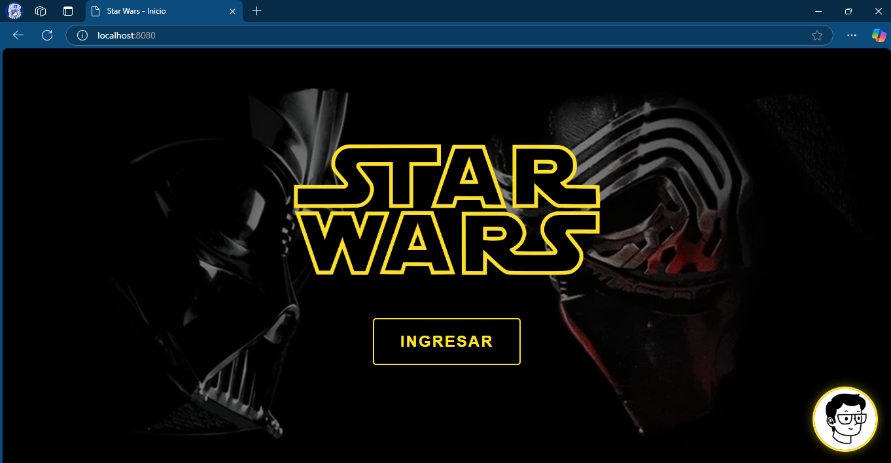
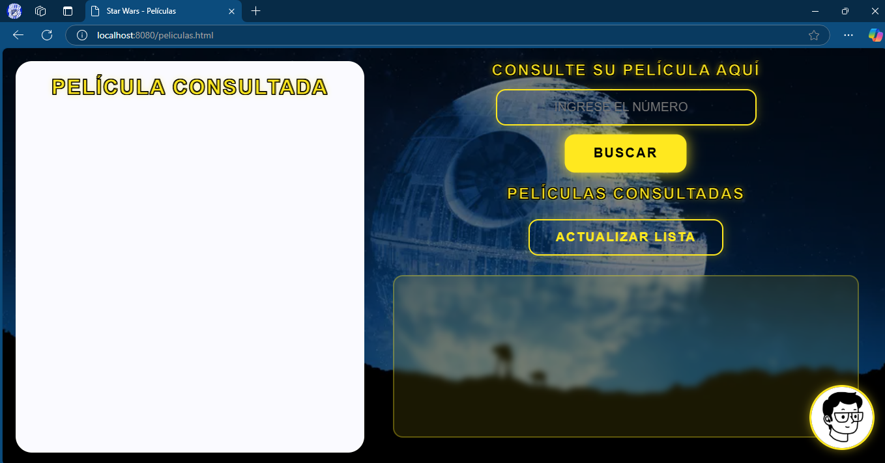
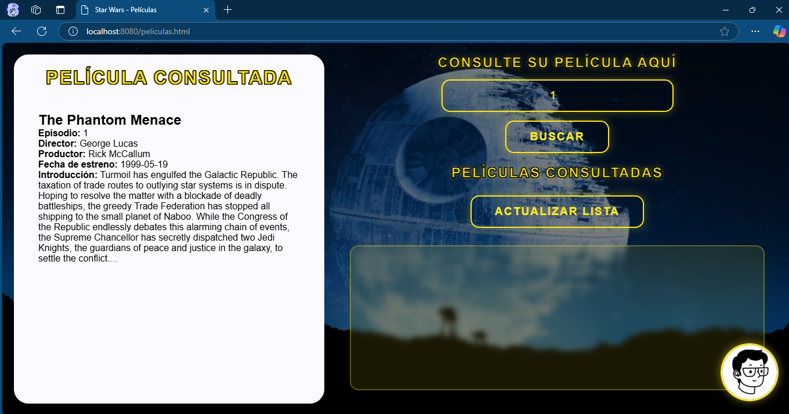
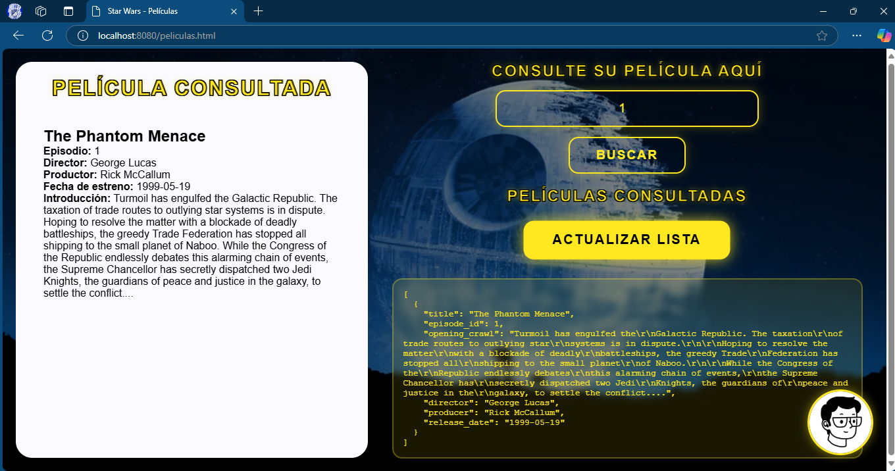

# **Star Wars Movie API - Taller 2 AREP**


## 📌 Descripción

Este proyecto es una aplicación web desarrollada en Java que permite consultar información sobre las películas de Star Wars. Utiliza una API externa (SWAPI - The Star Wars API) para obtener los datos de las películas y los muestra al usuario de forma amigable.

## 🚀 Tecnologías Utilizadas

- Java 8+

- Spring Boot

- Maven

- Gson

- HTML, CSS y JavaScript

- SWAPI (Star Wars API)

## 🎬 Funcionamiento de la Aplicación

1. El usuario ingresa el ID del episodio de Star Wars en la interfaz web.



2. La aplicación realiza una solicitud a la API de SWAPI para obtener los datos de la película correspondiente.

3. La información obtenida es procesada y mostrada en la interfaz de usuario de forma clara y estructurada.

4. La aplicación mantiene una lista de las películas que han sido consultadas por el usuario durante la sesión.



## 🔧 Instalación y Ejecución

1️⃣ **Clonar el repositorio**

```
git clone https://github.com/tu-repo/AREP_Taller2.git
cd AREP_Taller2
```

2️⃣ **Compilar el proyecto con Maven**

```
mvn clean install
```

3️⃣ **Ejecutar la aplicación**

```
mvn spring-boot:run
```

4️⃣ **Acceder a la aplicación**

Abre tu navegador y dirígete a:

```
http://localhost:8080/
```

## 🌟 Ejecución de pruebas

Para ejecutar las pruebas, corra el siguiente comando:

```
mvn test
```

Las pruebas realizadas incluye el caso en que se hace get de un recurso como el index.html, y el servidor responde con el archivo solicitado. También se incluye los casos en que no existe el recurso solicitado

## 🔨 Arquitectura

La arquitectura de la aplicación de consulta de películas de Star Wars sigue un patrón de diseño Modelo-Vista-Controlador (MVC) y utiliza una arquitectura cliente-servidor.

1. Cliente (Frontend):

- Está desarrollado utilizando HTML, CSS y JavaScript.
- La interfaz de usuario permite a los usuarios ingresar el ID de una película y visualizar los detalles de la película consultada.
- El archivo app.js contiene la lógica del cliente, incluyendo la realización de peticiones al servidor y la manipulación del DOM para mostrar los resultados.

2. Servidor (Backend):

- Está desarrollado en Java utilizando el paquete com.sun.net.httpserver para crear un servidor HTTP.
- La clase principal StarWarsWebApp configura las rutas y inicia el servidor.
- El servidor expone una API REST para que el cliente pueda interactuar con él.

3. Controlador:

- La clase MovieController actúa como controlador en esta aplicación.
- Recibe las peticiones del cliente para obtener información de una película específica.
- Valida los parámetros de entrada y utiliza el servicio correspondiente para obtener los datos de la película.
- Devuelve los datos de la película al cliente en formato JSON.

4. Servicio:

- La clase MovieService actúa como servicio en esta aplicación.
- Realiza las peticiones HTTP a la API externa utilizando el ID de la película proporcionado por el controlador.
- Procesa la respuesta JSON recibida de la API y la convierte en objetos de la clase Movie.

5. Modelo:

- La clase Movie actúa como modelo en esta aplicación.
- Define los atributos y métodos relacionados con una película, como título, episodio, director, productor, fecha de lanzamiento y texto de apertura.

## 🔗 Endpoints Disponibles

-  ```GET /movie/{id}``` → Devuelve información sobre la película correspondiente al episodio indicado.

- ```GET /``` → Página principal de la aplicación.

## ⚠️ Posibles Errores y Soluciones

- **Película no encontrada:** Asegúrate de que el número de la película a consultar esté entre 1 y 7, ya que la API solo cubre esas entregas de la saga.

- **Error de conexión:** Verifica tu conexión a Internet y asegúrate de que la API de SWAPI está en línea.

### 📌 Autores:
- Juan Pablo Daza Pereira (JuanPabl07DP)

### 📅 Fecha de creación: Febrero 2025
